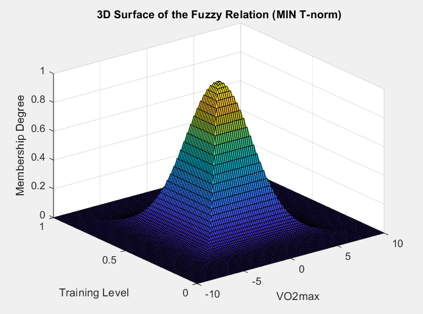
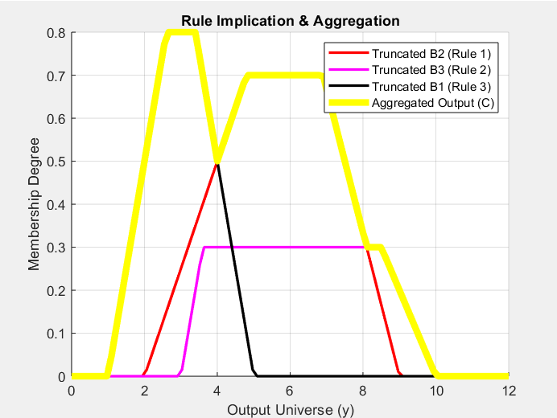
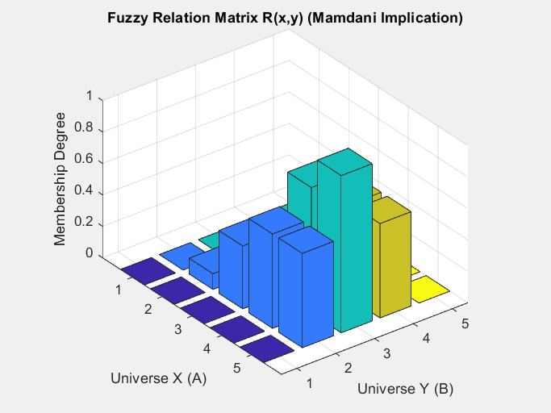
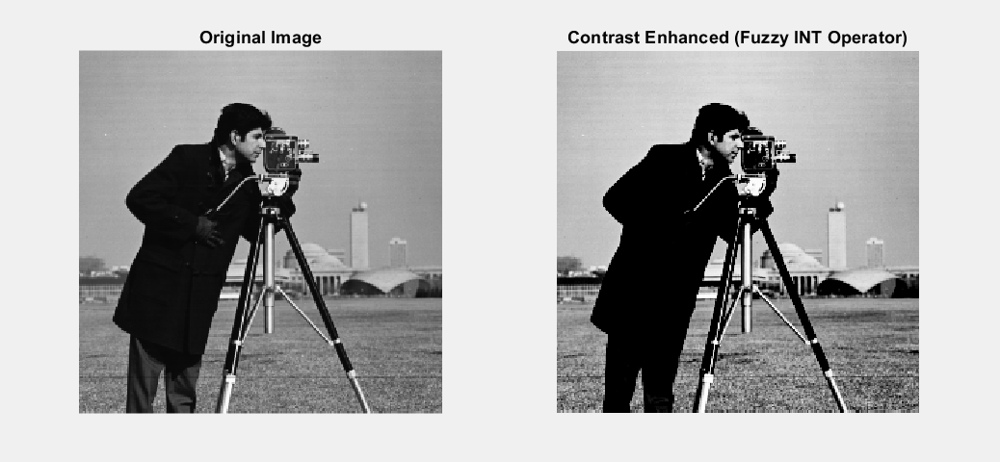

# Fuzzy Logic & Image Processing - MATLAB Portfolio

This repository contains a collection of MATLAB scripts developed for educational and research purposes. Originally presented during **IEEE Student Branch tutorials**, these scripts aim to bridge the mathematical theory of Fuzzy Logic Systems with practical applications in Computational Intelligence and Medical Image Processing.

## Repository Overview

### 1. Fuzzy Relations, Partitions & Modifiers
* **`fuzzy_relation_3d.m`**: Computes and visualizes a fuzzy relation between two universes of discourse using Gaussian MFs and Ruspini partitions.
* **`fuzzy_partitions_operators.m`**: Implements advanced fuzzy logic operators from scratch (Yager Complement, Standard Union/Intersection, Drastic Sum).
* **`linguistic_hedges_image_fuzzification.m`**: Explores Linguistic Hedges (Modifiers). Demonstrates Dilation (e.g., "Somewhat") and Concentration (e.g., "Very").

### 2. Fuzzy Inference Systems (FIS) & Defuzzification
* **`mamdani_inference_defuzzification.m`**: Complete implementation of Mamdani Inference. Demonstrates rule firing strengths, implication (clipping), aggregation (MAX), and Centroid Defuzzification.
* **`godel_larsen_implications_exercises.m`**: Advanced exercises covering the **Gödel Implication**, Max-Product Composition, and visual comparison between **Mamdani (Clipping)** and **Larsen (Scaling)**.
* **`gmp_compositional_rule_inference.m`**: Theoretical core of Generalized Modus Ponens (GMP). Implements the Compositional Rule of Inference (CRI) with Max-Min composition.
* **`chained_inference_reichenbach.m`**: Demonstrates chained fuzzy inference using Reichenbach Implication.
* **`defuzzification_methods_comparison.m`**: Compares Defuzzification methods manually: Centroid, Mean of Maximum (MoM), and Weighted Average.
* **`triangular_membership_vo2max.m`**: Practical evaluation of crisp inputs using Triangular Membership Functions (`trimf`) for physiological parameters.

### 3. Fuzzy Logic in Image Processing (Computer Vision)
* **`fuzzy_image_contrast_enhancement.m`**: A practical application in Computer Vision. Fuzzifies an image using the Property Domain G-function, applies the **Intensification (INT)** operator to enhance contrast, and defuzzifies the result back to the spatial domain.
* **`fuzzy_arithmetic_and_image_fuzzification.m`**: Covers Zadeh's Extension Principle using `fuzarith` for fuzzy addition/multiplication, and plots the transition function for mapping 8-bit image pixels to fuzzy memberships.

---
*Created by a final-year Biomedical Engineering student (University of West Attica), specializing in Artificial Intelligence, Deep Learning, and Medical Image Analysis.*
